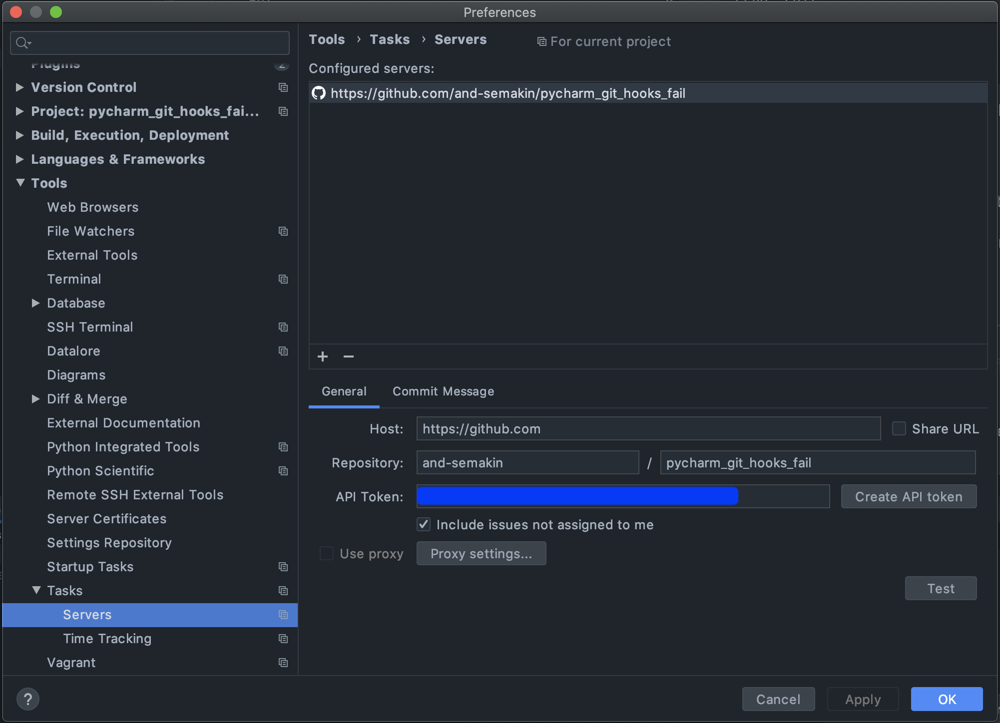
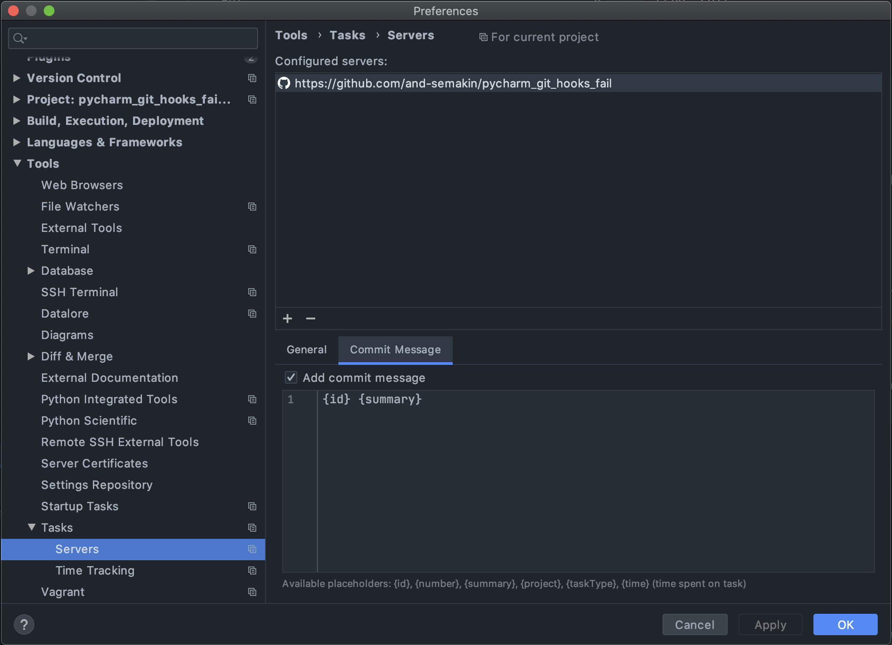

# PyCharm loses commit info if git hook fails

PyCharm (and probably another IDEA-based IDEs as well)
doesn't preserve Git commit info, such as:
* commit message;
* selected files/lines;

if Git hooks fails and interrupts commit process.

## Setup

0. Clone this repo;

0. Create always failing Git hook:

    ```shell script
    cat <<EOT >> .git/hooks/pre-commit
    echo "Fail!"
    false
    EOT
    chmod +x .git/hooks/pre-commit
    ```

0. Configure remote task server in your IDE (Settings > Tools > Tasks > Server):
    * Add GitHub repo as remote task server;
    
    * Configure default message for the task server!
    
    
0. Start task:
    * Tools > Tasks & Contexts > Open Task...
    * Choose "Test issue: add your name and fix typos"

0. Try changing two different files: `1.txt` and `2.txt`;

0. Open "Commit Changes" window (Ctrl+K or Cmd+K);

0. Type some commit message (overwrite default one), add one file to commit but don't add another;

0. "Run Git hooks" option should be enabled;

0. Commit it, it will fail;

0. Open "Commit Changes" window again;

0. Where is your changes (message, selected files)? Everything was reset to default values.
